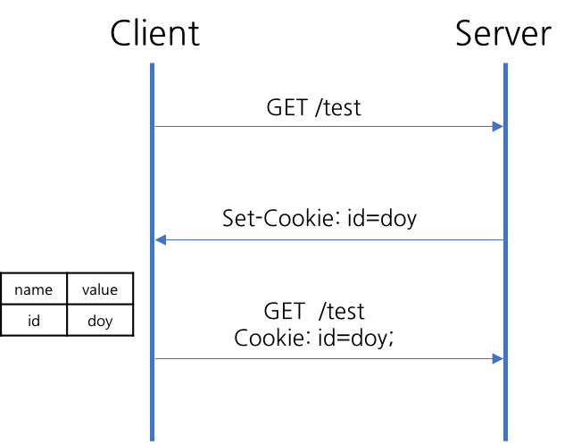
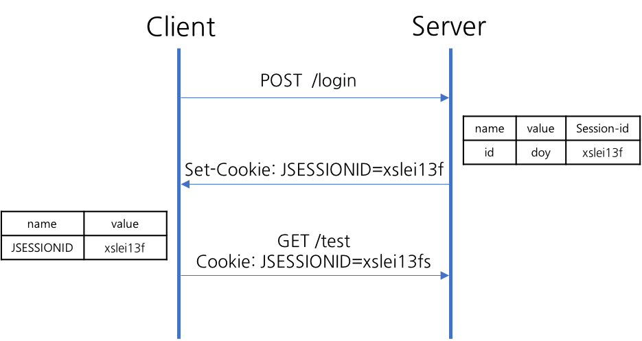

> HTTP 프로토콜에서 상태를 유지하기 위한 기술인 쿠키와 세션의 개념과 차이점을 알 수 있다.
<!--more-->

### HTTP 프로토콜의 특징
* **비연결 지향(Connectionless)**
    * 클라이언트가 request를 서버에 보내고, 서버가 클라이언트에 요청에 맞는 response를 보내면 바로 연결을 끊는다.
* **상태정보 유지 안 함(Stateless)**
    * 연결을 끊는 순간 클라이언트와 서버의 통신은 끝나며 상태 정보를 유지하지 않는다.
* 쿠키와 세션의 필요성
    * HTTP 프로토콜은 위와 같은 특징으로 모든 요청 간 의존관계가 없다.
    * 즉, 현재 접속한 사용자가 이전에 접속했던 사용자와 같은 사용자인지 아닌지 알 수 있는 방법이 없다.
    * 계속해서 연결을 유지하지 않기 때문에 리소스 낭비가 줄어드는 것이 큰 장점이지만, 통신할 때마다 새로 연결하기 때문에 클라이언트는 매 요청마다 인증을 해야 한다는 단점이 있다.
    * 이전 요청과 현재 요청이 같은 사용자의 요청인지 알기 위해서는 상태를 유지해야 한다.
    * HTTP 프로토콜에서 상태를 유지하기 위한 기술로 쿠키와 세션이 있다.

### 쿠키(Cookie) 란?
* 개념
    * 클라이언트 로컬에 저장되는 키와 값이 들어있는 파일이다.
    * 이름, 값, 유호 시간, 경로 등을 포함하고 있다.
    * 클라이언트의 상태 정보를 브라우저에 저장하여 참조한다.
* 구성 요소
    * 쿠키의 이름(name)
    * 쿠키의 값(value)
    * 쿠키의 만료시간(Expires)
    * 쿠키를 전송할 도메인 이름(Domain)
    * 쿠키를 전송할 경로(Path)
    * 보안 연결 여부(Secure)
    * HttpOnly 여부(HttpOnly)
* 동작 방식  
    
    1. 웹브라우저가 서버에 요청
    2. 상태를 유지하고 싶은 값을 쿠키(cookie)로 생성
    3. 서버가 응답할 때 HTTP 헤더(Set-Cookie)에 쿠키를 포함해서 전송
        ```java
        Set−Cookie: id=doy
        ```
    4. 전달받은 쿠키는 웹브라우저에서 관리하고 있다가, 다음 요청 때 쿠키를 HTTP 헤더에 넣어서 전송
        ```java
        cookie: id=doy
        ```
    5. 서버에서는 쿠키 정보를 읽어 이전 상태 정보를 확인한 후 응답
* 쿠키 사용 예
    * 아이디, 비밀번호 저장
    * 쇼핑몰 장바구니

### 세션(Session) 이란?
* 개념
    * 일정 시간 동안 같은 브라우저로부터 들어오는 요청을 하나의 상태로 보고 그 상태를 유지하는 기술이다.
    * 즉, 웹 브라우저를 통해 서버에 접속한 이후부터 브라우저를 종료할 때까지 유지되는 상태이다.
* 동작 방식  
     
    1. 웹브라우저가 서버에 요청
    2. 서버가 해당 웹브라우저(클라이언트)에 유일한 ID(Session ID)를 부여함
    3. 서버가 응답할 때 HTTP 헤더(Set-Cookie)에 Session ID를 포함해서 전송  
    쿠키에 Session ID를 JSESSIONID 라는 이름으로 저장
        ```java
        Set−Cookie: JSESSIONID=xslei13f
        ```
    4. 웹브라우저는 이후 웹브라우저를 닫기까지 다음 요청 때 부여된 Session ID가 담겨있는 쿠키를 HTTP 헤더에 넣어서 전송
        ```java
        Cookie: JSESSIONID=xslei13f
        ```
    5. 서버는 세션 ID를 확인하고, 해당 세션에 관련된 정보를 확인한 후 응답

> 세션도 쿠키를 사용하여 값을 주고받으며 클라이언트의 상태 정보를 유지한다.  
> 즉, 상태 정보를 유지하는 수단은 **쿠키** 이다.

* 세션 사용 예
    * 로그인

### 쿠키와 세션의 차이점
* 저장 위치
    * 쿠키 : 클라이언트
    * 세션 : 서버
* 보안
    * 쿠키 : 클라이언트에 저장되므로 보안에 취약하다.
    * 세션 : 쿠키를 이용해 Session ID만 저장하고 이 값으로 구분해서 서버에서 처리하므로 비교적 보안성이 좋다.
* 라이프사이클
    * 쿠키 : 만료시간에 따라 브라우저를 종료해도 계속해서 남아 있을 수 있다.
    * 세션 : 만료시간을 정할 수 있지만 브라우저가 종료되면 만료시간에 상관없이 삭제된다.
* 속도
    * 쿠키 : 클라이언트에 저장되어서 서버에 요청 시 빠르다.
    * 세션 : 실제 저장된 정보가 서버에 있으므로 서버의 처리가 필요해 쿠키보다 느리다.

---
### Reference
- [http://jeong-pro.tistory.com/80](http://jeong-pro.tistory.com/80)
- [http://victorydntmd.tistory.com/34](http://victorydntmd.tistory.com/34)
- [http://www.fun-coding.org/crawl_advance1.html#6.1.-%EC%BF%A0%ED%82%A4(cookie):-%EC%83%81%ED%83%9C-%EC%A0%95%EB%B3%B4%EB%A5%BC-%ED%81%B4%EB%9D%BC%EC%9D%B4%EC%96%B8%ED%8A%B8%EC%97%90-%EC%A0%80%EC%9E%A5%ED%95%98%EB%8A%94-%EB%B0%A9%EC%8B%9D](http://www.fun-coding.org/crawl_advance1.html#6.1.-%EC%BF%A0%ED%82%A4(cookie):-%EC%83%81%ED%83%9C-%EC%A0%95%EB%B3%B4%EB%A5%BC-%ED%81%B4%EB%9D%BC%EC%9D%B4%EC%96%B8%ED%8A%B8%EC%97%90-%EC%A0%80%EC%9E%A5%ED%95%98%EB%8A%94-%EB%B0%A9%EC%8B%9D)